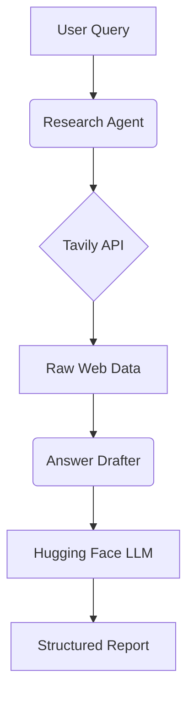

# Crawlyzer - Deep Research AI Agentic System – Implementation Report

## Abstract
This system addresses the challenge of automating deep web research through a dual-agent AI architecture. By combining Tavily's web crawling capabilities with Hugging Face's open-source LLMs, Crawlyzer provides structured insights while maintaining cost-efficiency. The system transforms raw web data into organized reports through sequential processing by specialized research and drafting agents.

## Implementation Details

### Tech Stack
| Component         | Technology       | Role                          |
|-------------------|------------------|-------------------------------|
| Web Crawling      | Tavily API       | Domain-agnostic data retrieval|
| LLM Core          | Hugging Face API | Answer generation (falcon-7b) |
| Workflow Engine   | LangGraph        | Agent coordination            |
| Environment       | python-dotenv    | Secure credential management  |

### Dual-Agent Architecture
**1. Research Agent**  
- Queries Tavily API with dynamic search parameters
- Filters/ranks results using content relevance scoring
- Outputs structured JSON with source metadata

**2. Answer Drafter Agent**  
- Processes raw data through Hugging Face inference endpoints
- Implements content truncation (500 token limit)
- Generates Markdown-formatted reports


## 🚧 Challenges & Adaptations

| Challenge                        | Solution Implemented              |
|----------------------------------|------------------------------------|
| **API Cost Constraints**         | Utilized Hugging Face's free tier with model quantization |
| **LLM Context Limits**           | Implemented content truncation (first 500 characters per source) |
| **Result Relevance**             | Developed scoring filter: `score > 0.7` |
| **Rate Limiting**                | Added 2s delay between API calls  |

## ⚠️ Current Limitations

| Limitation                      | Impact                              | Technical Cause                     |
|---------------------------------|-------------------------------------|--------------------------------------|
| **External API Dependency**     | Service availability risks          | Reliance on Hugging Face/Tavily APIs |
| **500-Character Truncation**    | Potential context loss              | LLM token limits (falcon-7b)         |
| **Single-Pass Generation**      | No iterative refinement             | Linear LangGraph workflow            |

## 🛠️ Installation & Usage

```bash
# 1. Clone repository
git clone https://github.com/NukGod-V/crawlyzer.git

# 2. Install dependencies
pip install -r requirements.txt

# 3. Configure environment
cp sample.env .env
```
